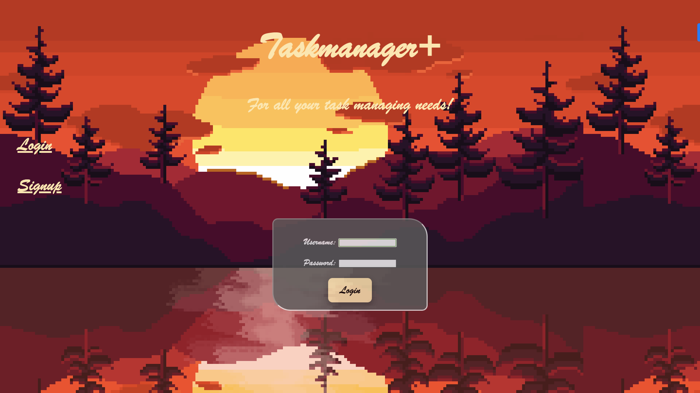
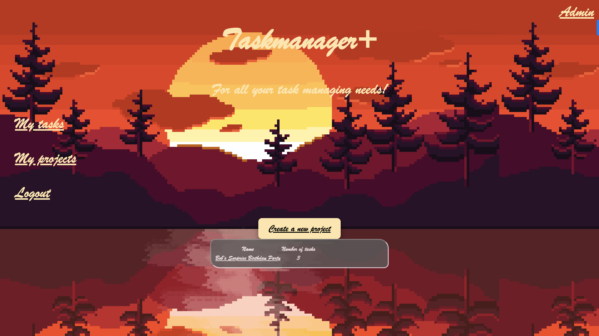
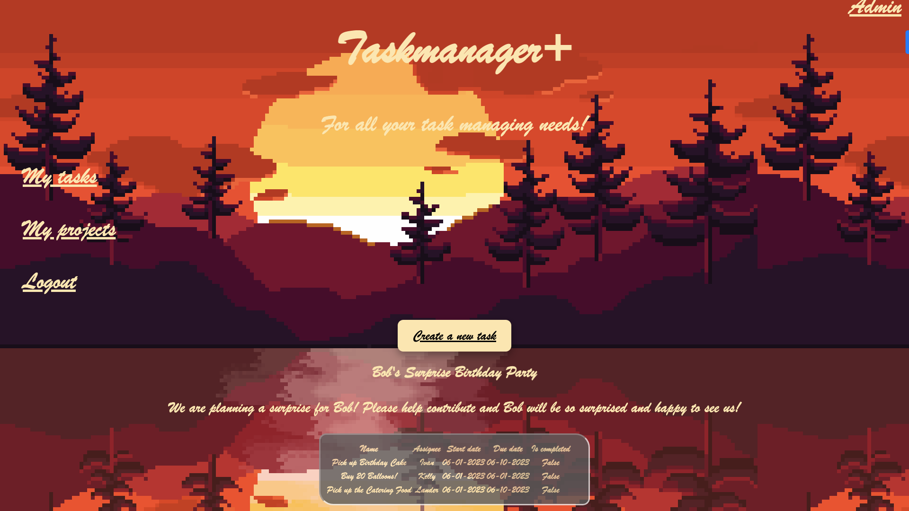

# Taskmanager+
### Summary
This project is a Task management system that allows users to sign-up, create projects, and delegate tasks within the project where they can add other users. The project uses Django, HTML, and CSS.

### Purpose
This project was used to challenge myself and familiarize CSS and HTML aspects in order to better my Frontend development skills.

### Deployment
In order to deploy this project, you need to make a virtual environment. Run the commands:

python -m venv .venv

source .venv/bin/activate 

pip install -r requiremenets.txt

python manage.py runserver

The django server should start and you should see this in your browser.

Main Page

My Projects Page

Clicking on a Project

